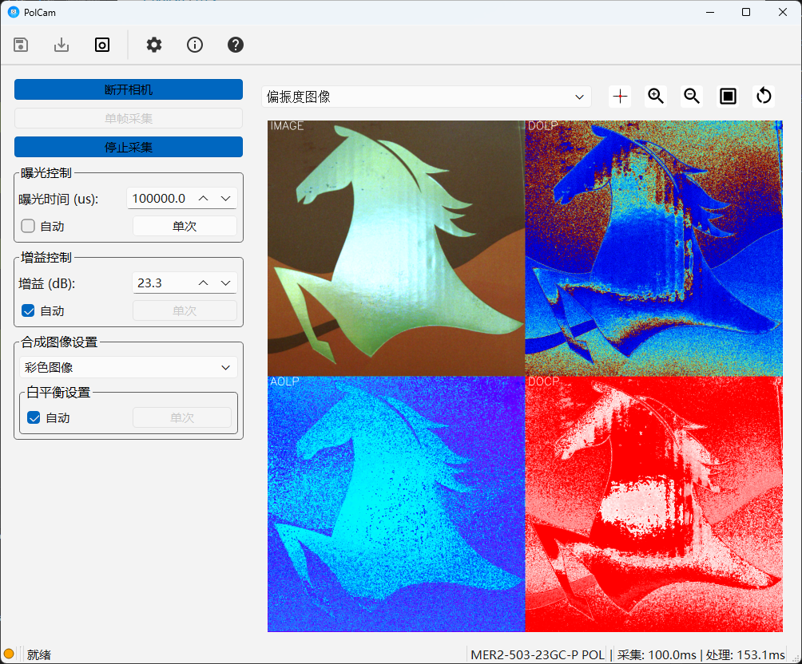

# PolCam - 偏振相机控制系统 (Polarization Camera Control System)

[English](#english) | [中文](#中文)

<p align="center">
  
</p>

## 中文

### 简介

PolCam 是一个用于控制和处理偏振相机图像的Python应用程序。它提供了直观的图形用户界面，支持实时图像采集、偏振图像处理和数据可视化功能。



### 功能特性

- 相机控制
  - 相机连接与断开
  - 多相机设备选择与连接（支持在弹窗中选择目标设备）
  - 自动相机类型识别（彩色偏振 / 黑白偏振 / 普通彩色）
  - 单帧图像采集
  - 连续图像采集
  - 实时参数调整（曝光、增益、白平衡）
  - ROI 控制（点击放大/缩小、框选放大、视图复原）
- 图像处理
  - 偏振图像解码
  - 偏振度计算
  - 普通彩色相机的 Bayer / PixelFormat 兼容处理
  - 显示模式按相机类型自适应（普通彩色相机仅显示可用模式）
  - 多种显示模式（原始图像、彩色图像、灰度图像、偏振度图像）
- 用户界面
  - 实时图像显示
  - 参数实时调节
  - 图像工具栏支持 ROI 缩放上限控制（最大约 100x）与状态提示
  - 四分图标题在不同分辨率下保持更一致的视觉尺寸
  - 自适应界面布局

### 安装要求

- Python 3.12+
- [DAHENG Galaxy 相机驱动](https://www.daheng-imaging.com/downloads/softwares/)
- 相关Python包（详见 `environment.yaml`）

### 快速开始

1. 克隆仓库：

```bash
git clone https://github.com/SeveNOlogy7/PolCam.git
cd PolCam
```

#### 使用 uv

2. 创建并激活 uv 环境：

```bash
uv sync
```

3. 运行程序：

```bash
uv run python main.py
```

#### 使用 Conda

2. 创建并激活 conda 环境：

```bash
conda env create -f environment.yaml
conda activate polcam
```

3. 运行程序：

```bash
python main.py
```

### 项目结构

```
PolCam/
├── main.py                 # 程序入口
├── pyproject.toml          # 项目配置（uv / 构建），版本号唯一来源
├── environment.yaml        # Conda 环境定义
├── PolCam.spec             # PyInstaller 打包配置
├── cliff.toml              # git-cliff 变更日志配置
├── packaging/
│   └── PolCam.iss          # Inno Setup 安装脚本
├── .github/workflows/
│   ├── ci.yml              # 测试矩阵（Windows / Linux）
│   └── release.yml         # tag 触发的打包与草稿发布
├── polcam/                 # 主应用源码
│   ├── core/               # 核心模块（相机、处理、事件、工具栏控制）
│   ├── gui/                # GUI 模块
│   │   └── widgets/        # GUI 子组件
│   ├── resources/          # 图标等资源
│   └── utils/              # 日志等工具
├── gxipy/                  # DAHENG 相机 Python SDK 封装
├── tools/
│   └── run_tests.py        # 按测试文件分进程跑整套测试
└── tests/                  # 测试代码
```

### 开发

#### 使用 uv

- 运行测试：`uv run python tools/run_tests.py`（一个测试文件一个进程；整套塞进一次 `uv run pytest` 会偶发 0xc0000374 / 段错误）
- 代码风格检查：`uv run flake8`
- 类型检查：`uv run mypy .`

#### 使用 Conda

- 运行测试：`python tools/run_tests.py`
- 代码风格检查：`flake8`
- 类型检查：`mypy .`

### 发布

版本号**只在 `pyproject.toml` 的 `[project].version` 声明一次**。运行时 `polcam.__version__` 从该文件解析（打包后从包内的 `pyproject.toml` 读，源码运行时从仓库根读），「关于」对话框直接显示它，不再单独维护。

`pyproject.toml` 里写的是**不带前缀的数字版本**（如 `1.0.0`）——PEP 440 不接受 `v` 前缀，加了 uv 会直接报错。但**所有给人看的地方一律带 `v`**：「关于」对话框、产物文件名、Release 标题、changelog 小节、安装包 `AppVersion`、exe 的 `ProductVersion`。exe 的 `FileVersion` 保持数字，那是 Windows 要求用于版本比较的字段。

发布由推 tag 触发，产物先进**草稿 Release**，人工确认后才公开：

1. 改 `pyproject.toml` 里的 `version`，提交并合入 `main`
2. 打 tag 并推送：`git tag -a v1.0.1 -m "PolCam v1.0.1" && git push origin v1.0.1`
3. `.github/workflows/release.yml` 在 `windows-latest` 上依次执行：跑测试套件作为门禁 → PyInstaller 打 onedir → 压便携 zip → Inno Setup 编安装包 → git-cliff 生成发布说明与 `CHANGELOG.md` → 建草稿 Release
4. 到 [Releases](https://github.com/SeveNOlogy7/PolCam/releases) 检查草稿，确认后点 publish

tag 必须是 `v` + `pyproject.toml` 里的版本，两者不一致时门禁直接失败。

产物两个：`PolCam-v<版本>-win64.exe`（安装包，含开始菜单项与卸载器）和 `PolCam-v<版本>-win64-portable.zip`（解压即用）。

发布说明由 [git-cliff](https://git-cliff.org/) 从提交历史生成，因此提交信息请写 conventional 前缀（`feat:` / `fix:` / `perf:` / `test:` / `ci:` / `docs:` / `chore:`，可带 scope）。非 conventional 的提交也不会被丢弃，会归入「其他」。

两个不要踩的点：

- `packaging/PolCam.iss` 里的 `AppId` GUID **发布后绝不能改**。改了以后新版本会被 Windows 当成另一个程序，覆盖不了旧安装、控制面板里会并存两份。
- `PolCam.spec` 的 `datas` 必须包含 `pyproject.toml`。漏了的话打包出来的应用读不到版本，「关于」会显示 `0.0.0+unknown`。

另外：本机没装大恒 Galaxy 驱动也能启动，此时相机连接与采集不可用，但仍可通过工具栏读取已保存的原始图像做处理。

### 许可证

MIT License

---

## English

### Introduction

PolCam is a Python application for controlling and processing polarization camera images. It provides an intuitive graphical user interface with real-time image acquisition, polarization image processing, and data visualization capabilities.


### Features

- Camera Control
  - Camera connection/disconnection
  - Multi-camera device selection and target-camera connection via dialog
  - Automatic camera type detection (polarization color / polarization mono / normal color)
  - Single frame capture
  - Continuous capture
  - Real-time parameter adjustment (exposure, gain, white balance)
  - ROI control (click zoom in/out, drag-to-zoom, reset view)
- Image Processing
  - Polarization image demosaicing
  - Degree of polarization calculation
  - Bayer / PixelFormat-aware processing for normal color cameras
  - Camera-type-aware display mode filtering (only valid modes are shown)
  - Multiple display modes (raw, color, grayscale, polarization)
- User Interface
  - Real-time image display
  - Parameter adjustment
  - Toolbar zoom guard with max zoom handling (~100x) and status feedback
  - More consistent quad-view title rendering across different subplot sizes
  - Adaptive layout

### Requirements

- Python 3.12+
- [DAHENG Galaxy camera drivers](https://www.daheng-imaging.com/downloads/softwares/)
- Python packages (see `environment.yaml`)

### Quick Start

1. Clone repository:

```bash
git clone https://github.com/SeveNOlogy7/PolCam.git
cd PolCam
```

#### Use uv

2. Create and activate uv environment:

```bash
uv sync
```

3. Run program:

```bash
uv run python main.py
```

#### Use Conda

2. Create and activate conda environment:

```bash
conda env create -f environment.yaml
conda activate polcam
```

3. Run program:

```bash
python main.py
```

### Project Structure

```
PolCam/
├── main.py                 # Application entry point
├── pyproject.toml          # Project config (uv / build); single source of the version
├── environment.yaml        # Conda environment definition
├── PolCam.spec             # PyInstaller build specification
├── cliff.toml              # git-cliff changelog configuration
├── packaging/
│   └── PolCam.iss          # Inno Setup installer script
├── .github/workflows/
│   ├── ci.yml              # Test matrix (Windows / Linux)
│   └── release.yml         # Tag-triggered packaging and draft release
├── polcam/                 # Main application source
│   ├── core/               # Core modules (camera, processing, events, toolbar control)
│   ├── gui/                # GUI modules
│   │   └── widgets/        # GUI sub-components
│   ├── resources/          # Icons and static resources
│   └── utils/              # Utilities (logging, etc.)
├── gxipy/                  # DAHENG camera Python SDK wrapper
└── tests/                  # Test suite
```

### Development

#### Use uv

- Run tests: `uv run python tools/run_tests.py` (one process per test file; a single `uv run pytest` run intermittently dies with 0xc0000374 / segfault)
- Style check: `uv run flake8`
- Type check: `uv run mypy .`

#### Use Conda

- Run tests: `python tools/run_tests.py`
- Style check: `flake8`
- Type check: `mypy .`

### Release

The version is declared **exactly once**, in `[project].version` of `pyproject.toml`.
`polcam.__version__` parses that file at runtime (from inside the bundle when frozen,
from the repository root when running from source), and the About dialog displays it
rather than keeping its own copy.

`pyproject.toml` holds the **bare numeric version** (e.g. `1.0.0`) — PEP 440 does not
accept a `v` prefix and uv rejects it. Everything a human sees is **`v`-prefixed**:
the About dialog, artifact filenames, the release title, changelog headings, the
installer's `AppVersion`, and the exe's `ProductVersion`. The exe's `FileVersion`
stays numeric, since Windows uses that field for version comparison.

Releases are triggered by pushing a tag, and the result lands as a **draft release**
first — nothing is public until a human publishes it:

1. Bump `version` in `pyproject.toml`, commit, merge to `main`
2. Tag and push: `git tag -a v1.0.1 -m "PolCam v1.0.1" && git push origin v1.0.1`
3. `.github/workflows/release.yml` runs on `windows-latest`: test suite as a gate →
   PyInstaller onedir → portable zip → Inno Setup installer → git-cliff release notes
   and `CHANGELOG.md` → draft release
4. Review the draft at [Releases](https://github.com/SeveNOlogy7/PolCam/releases) and
   publish when it looks right

The tag must be `v` plus the `pyproject.toml` version; the gate fails if they disagree.

Two artifacts are produced: `PolCam-v<version>-win64.exe` (installer, with Start Menu
entry and uninstaller) and `PolCam-v<version>-win64-portable.zip` (extract and run).

Release notes are generated by [git-cliff](https://git-cliff.org/) from commit history,
so write commit subjects with a conventional prefix (`feat:` / `fix:` / `perf:` /
`test:` / `ci:` / `docs:` / `chore:`, optionally with a scope). Non-conventional
commits are kept too, under "其他".

Two things not to change:

- The `AppId` GUID in `packaging/PolCam.iss` must **never change after the first
  release**. If it does, Windows treats a new build as a different program: it will
  not upgrade the old install, and both will appear in Add/Remove Programs.
- `datas` in `PolCam.spec` must include `pyproject.toml`. Without it the frozen app
  cannot resolve its version and the About dialog shows `0.0.0+unknown`.

The app also starts without the DAHENG Galaxy SDK installed: camera connect and
capture are unavailable, but saved raw images can still be loaded from the toolbar
and processed.

### License

MIT License
